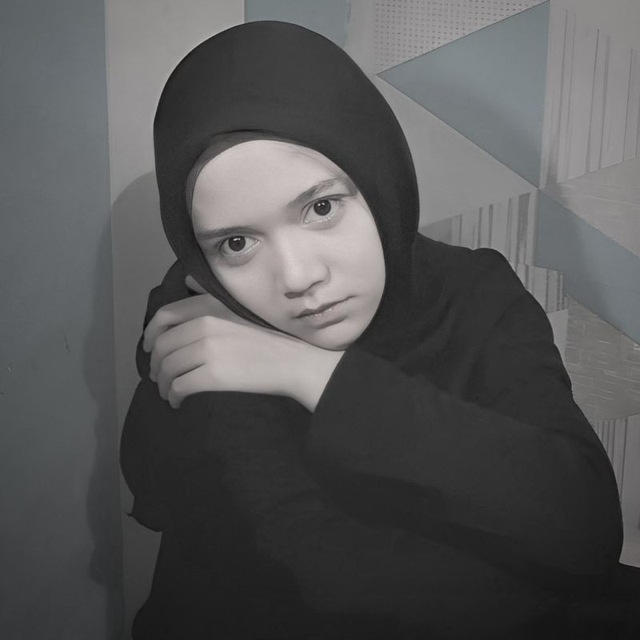

```
Febriyani Nurhida
312210222
TI.2.A.2
```

## **Daftar Isi**

**1. [Instruksi Praktikum](#instruksi-praktikum)**  
**2. [Langkah-langkah Praktikum](#langkah-langkah-praktikum)**  
**3. [Membuat Laman Artikel, About, dan Contact](#Membuat-Laman-Artikel,-About,-dan-Contact)**

## **Instruksi Praktikum**

1. Persiapkan text editor misalnya VSCode.
2. Buat folder baru dengan nama Lab3Web
3. Ikuti langkah-langkah praktikum yang akan dijelaskan berikutnya.
4. Lakukan validasi dokumen html dengan mengakses http://validator.w3.org

## **Langkah-langkah Praktikum**

Berikut adalah langkah-langkah umum untuk membuat sebuah website dengan HTML dan Bootstrap:

**1. Persiapkan Tools dan Lingkungan Kerja:**

Pastikan Anda memiliki teks editor seperti Visual Studio Code, Sublime Text, atau Notepad++ untuk menulis kode.
Unduh Bootstrap dari situs resmi mereka atau gunakan versi Bootstrap dari CDN (Content Delivery Network).
Inisialisasi Proyek:

Buat direktori proyek untuk website Anda.
Buat file HTML baru dan beri nama index.html.
Struktur Dasar HTML:

Mulai dengan kode HTML dasar, termasuk elemen `html`, `head`, dan `body`.
Tambahkan tag <meta> untuk mengatur karakter set dan viewport.
Sisipkan referensi ke Bootstrap CSS di bagian <head>.
html

```html
<!DOCTYPE html>
<html lang="en">
  <head>
    <meta charset="UTF-8" />
    <meta name="viewport" content="width=device-width, initial-scale=1.0" />
    <!-- Tambahkan link ke Bootstrap CSS -->
    <link
      href="https://cdn.jsdelivr.net/npm/bootstrap@5.3.0/dist/css/bootstrap.min.css"
      rel="stylesheet"
    />
    <title>Nama Website Anda</title>
  </head>
  <body>
    <!-- Konten Website Anda akan ditambahkan di sini -->
    <!-- Tambahkan referensi ke Bootstrap JavaScript di bagian bawah body -->
    <script src="https://cdn.jsdelivr.net/npm/bootstrap@5.3.0/dist/js/bootstrap.bundle.min.js"></script>
  </body>
</html>
```

**2. Membangun Tampilan dengan Bootstrap:**

Gunakan kelas-kelas Bootstrap seperti container, row, dan col untuk membangun tata letak halaman.
Tambahkan elemen HTML, teks, dan gambar sesuai kebutuhan.
Anda dapat menggunakan komponen Bootstrap seperti navigasi, jumbotron, dan card untuk mempercepat pembuatan tampilan.
Berikut adalah struktur dasar : 
```html
<body>
    <div class="container">

        <header>
            <h1>Layout Sederhana</h1>
        </header>

        <nav>
            <a href="#" class="active">Home</a>
            <a href="#article">Artikel</a>
            <a href="#about">About</a>
            <a href="#contact">Kontak</a>
        </nav>

        <section id="hero">
            <h1>Hello World!</h1>
            <p>Lorem ipsum dolor sit amet, consectetur adipiscing elit. Vestibulum lorem
                elit, iaculis innisl volutpat, malesuada tincidunt arcu. Proin in leo fringilla,
                vestibulum mi porta, faucibus felis. Integer pharetra est nunc, nec pretium nunc
                pretium ac.</p>
            <a href="home.html" class="btn btn-large">Learn more &raquo;</a>
        </section>

        <section id="wrapper">
            <section id="main">
                <div class="row">
                    <div class="box">
                        
                        <h3>Heading</h3>
                        <p>Donec sed odio dui. Etiam porta sem malesuada magna mollis
                            euismod.</p>
                        <a href="#" class="btn btn-default">View detail</a>
                    </div>
                    <div class="box">
                        
                        <h3>Heading</h3>
                        <p>Donec sed odio dui. Etiam porta sem malesuada magna mollis
                            euismod.</p>
                        <a href="#" class="btn btn-default">View detail</a>
                    </div>
                    <div class="box">
                        
                        <h3>Heading</h3>
                        <p>Donec sed odio dui. Etiam porta sem malesuada magna mollis
                            euismod.</p>
                        <a href="#" class="btn btn-default">View detail</a>
                    </div>
                </div>

                <hr class="divider" />
                <article class="entry" id="article">
                    <h2>First featurette heading.</h2>
                    
                    <p>Lorem ipsum dolor sit amet, consectetur adipiscing elit. Vestibulum lorem
                        elit, iaculis in nisl volutpat, malesuada tincidunt arcu. Proin in leo fringilla,
                        vestibulum mi porta, faucibus felis. Integer pharetra est nunc, nec pretium nunc
                        pretium ac.</p>
                </article>

                <hr class="divider" />
                <article class="entry">
                    <h2>First featurette heading.</h2>
                    
                    <p>Lorem ipsum dolor sit amet, consectetur adipiscing elit. Vestibulum lorem
                        elit, iaculis in nisl volutpat, malesuada tincidunt arcu. Proin in leo fringilla,
                        vestibulum mi porta, faucibus felis. Integer pharetra est nunc, nec pretium nunc
                        pretium ac.</p>
                </article>
            </section>

            <aside id="sidebar">
                <div class="widget-box">
                    <h3 class="title">Widget Header</h3>
                    <ul>
                        <li><a href="#">Widget Link</a></li>
                        <li><a href="#">Widget Link</a></li>
                        <li><a href="#">Widget Link</a></li>
                        <li><a href="#">Widget Link</a></li>
                        <li><a href="#">Widget Link</a></li>
                    </ul>
                </div>

                <div class="widget-box">
                    <h3 class="title">Widget Text</h3>
                    <p>Vestibulum lorem elit, iaculis in nisl volutpat, malesuada tincidunt
                        arcu. Proin in leo fringilla, vestibulum mi porta, faucibus felis. Integer
                        pharetra est nunc, nec pretium nunc pretium ac.</p>
                </div>
            </aside>
        </section>

        <footer>
            <p>&copy; 2021 - Universitas Pelita Bangsa</p>
        </footer>
    </div>
```


**Ouput sebelum diberi style bootstrap**


**3. Custom CSS (Opsional):**

Jika Anda ingin menyesuaikan tampilan lebih lanjut, Anda dapat menambahkan CSS kustom Anda sendiri. Buat file CSS terpisah atau tambahkan gaya langsung ke dalam tag `style` di bagian `head HTML`. Ini adalah tambahan css styles pada website ini:
```html
    <!-- Css styles -->
    <style>
        * {
            margin: 0;
            padding: 0;
            box-sizing: border-box;
        }

        body {
            font-family: "Open Sans", sans-serif;
            font-size: 100%;
        }

        #container {
            height: 1300px;
        }

        nav a.active,
        nav a:hover {
            background-color: #68a4e8;
        }

        .widget-box li:hover a {
            background-color: #eee;
        }

        .row:after,
        .row:before,
        .entry:after,
        .entry:before {
            content: "";
            display: table;
        }

        .row:after,
        .entry:after {
            clear: both;
        }
    </style>
```


**4. Ini adalah keseluruhan program**
```html
<body class="text-body-secondary lh-1">
    <div class="container w-75 shadow-lg p-3 mb-0 bg-body-tertiary rounded" id="container">

        <header class="p-3">
            <h1 class="mt-2 mb-2 me-1 ms-1 text-body-tertiary fw-bold">Layout Sederhana</h1>
        </header>

        <nav class="bg-primary d-block">
            <a href="#"
                class="active pt-3 pb-3 ps-3 pe-3 text-white fs-6 fw-bold text-decoration-none d-inline-block">Home</a>
            <a href="#article"
                class="pt-3 pb-3 ps-3 pe-3 text-white fs-6 fw-bold text-decoration-none d-inline-block">Artikel</a>
            <a href="#about"
                class="pt-3 pb-3 ps-3 pe-3 text-white fs-6 fw-bold text-decoration-none d-inline-block">About</a>
            <a href="#contact"
                class="pt-3 pb-3 ps-3 pe-3 text-white fs-6 fw-bold text-decoration-none d-inline-block">Kontak</a>
        </nav>

        <section id="hero" class="bg-dark-subtle pb-5 pt-5 pe-3 ps-3 mb-2">
            <h1 class="mb-4 fs-1 fw-bold">Hello World!</h1>
            <p class="mb-3 fs-5 lh-base">Lorem ipsum dolor sit amet, consectetur adipiscing elit. Vestibulum lorem
                elit, iaculis innisl volutpat, malesuada tincidunt arcu. Proin in leo fringilla,
                vestibulum mi porta, faucibus felis. Integer pharetra est nunc, nec pretium nunc
                pretium ac.</p>
            <a href="home.html" class="btn btn-large">Learn more &raquo;</a>
        </section>

        <section id="wrapper" class="m-0 position-relative">
            <section id="main" class="float-start w-75 p-2 ">
                <div class="row">
                    <div class="box pt-0 pb-0 pe-2 d-block float-none w-25">
                        
                        <h3 class="mt-2 mb-2 me-0 ms-0 text-center fs-4 fw-bold">Heading</h3>
                        <p class="lh-base fs-6 mb-2 text-center">Donec sed odio dui. Etiam porta sem malesuada magna
                            mollis
                            euismod.</p>
                        <a href="#" class="ms-5 fw-medium fs-6 btn bg-dark-subtle p-2 rounded">View detail</a>
                    </div>
                    <div class="box pt-0 pb-0 pe-2 ps-2 d-block float-start w-25 align-items-center">
                        
                        <h3 class="mt-2 mb-2 me-0 ms-0 text-center fs-4 fw-bold">Heading</h3>
                        <p class="lh-base fs-6 mb-2 text-center">Donec sed odio dui. Etiam porta sem malesuada magna
                            mollis
                            euismod.</p>
                        <a href="#" class="ms-5 fw-medium fs-6 btn bg-dark-subtle p-2 rounded">View detail</a>
                    </div>
                    <div class="box pt-0 pb-0 pe-2 ps-2 d-block float-start w-25 align-items-center">
                        
                        <h3 class="mt-2 mb-2 me-0 ms-0 text-center fs-4 fw-bold">Heading</h3>
                        <p class="lh-base fs-6 mb-2 text-center">Donec sed odio dui. Etiam porta sem malesuada magna
                            mollis
                            euismod.</p>
                        <a href="#" class="ms-5 fw-medium fs-6 btn bg-dark-subtle p-2 rounded">View detail</a>
                    </div>
                </div>

                <hr class="divider border-0 border-top border-light-subtle mb-3 mt-3 me-0 ms-0" />
                <article class="entry mb-2 mt-2 me-0 ms-0" id="article">
                    <h2 class="mb-2 fs-3 fw-bold">First featurette heading.</h2>
                    
                    <p class="lh-base">Lorem ipsum dolor sit amet, consectetur adipiscing elit. Vestibulum lorem
                        elit, iaculis in nisl volutpat, malesuada tincidunt arcu. Proin in leo fringilla,
                        vestibulum mi porta, faucibus felis. Integer pharetra est nunc, nec pretium nunc
                        pretium ac.</p>
                </article>

                <hr class="divider  border-0 border-top border-light-subtle mb-3 mt-3 me-0 ms-0" />
                <article class="entry mb-2 mt-2 me-0 ms-0">
                    <h2 class="mb-3 fs-3 fw-bold">First featurette heading.</h2>
                    
                    <p class="lh-base">Lorem ipsum dolor sit amet, consectetur adipiscing elit. Vestibulum lorem
                        elit, iaculis in nisl volutpat, malesuada tincidunt arcu. Proin in leo fringilla,
                        vestibulum mi porta, faucibus felis. Integer pharetra est nunc, nec pretium nunc
                        pretium ac.</p>
                </article>
            </section>

            <aside id="sidebar" class="float-start w-25 p-3">
                <div class="widget-box border border-secondary mb-3">
                    <h3 class="title pt-2 pb-2 ps-2 pe-2 bg-primary text-white fs-4">Widget Header</h3>
                    <ul class="list-unstyled">
                        <li class="border-bottom border-secondary"><a
                                class="pt-2 pb-2 pe-3 ps-3 text-success-emphasis d-block text-decoration-none"
                                href="#">Widget Link</a></li>
                        <li class="border-bottom border-secondary"><a
                                class="pt-2 pb-2 pe-3 ps-3 text-success-emphasis d-block text-decoration-none"
                                href="#">Widget Link</a></li>
                        <li class="border-bottom border-secondary"><a
                                class="pt-2 pb-2 pe-3 ps-3 text-success-emphasis d-block text-decoration-none"
                                href="#">Widget Link</a></li>
                        <li class="border-bottom border-secondary"><a
                                class="pt-2 pb-2 pe-3 ps-3 text-success-emphasis d-block text-decoration-none"
                                href="#">Widget Link</a></li>
                        <li class="border-bottom border-secondary"><a
                                class="pt-2 pb-2 pe-3 ps-3 text-success-emphasis d-block text-decoration-none"
                                href="#">Widget Link</a></li>
                    </ul>
                </div>

                <div class="widget-box border border-secondary mb-3">
                    <h3 class="title pt-2 pb-2 ps-2 pe-2 bg-primary text-white fs-4">Widget Text</h3>
                    <p class="p-2 lh-base">Vestibulum lorem elit, iaculis in nisl volutpat, malesuada tincidunt
                        arcu. Proin in leo fringilla, vestibulum mi porta, faucibus felis. Integer
                        pharetra est nunc, nec pretium nunc pretium ac.</p>
                </div>
            </aside>
        </section>

    </div>
    <footer class="w-75 text-white bg-dark mx-auto p-2 text-center">
        <p>&copy; 2021 - Universitas Pelita Bangsa</p>
    </footer>


    <!-- Feather icon -->
    <script>
        feather.replace();
    </script>

    <!-- Bootstrap -->
    <script src="https://cdn.jsdelivr.net/npm/bootstrap@5.3.2/dist/js/bootstrap.bundle.min.js"
        integrity="sha384-C6RzsynM9kWDrMNeT87bh95OGNyZPhcTNXj1NW7RuBCsyN/o0jlpcV8Qyq46cDfL"
        crossorigin="anonymous"></script>
body>
```


**Output sesudah menggunakan style bootstrap**


**Membuat Laman Artikel, About, dan Contact**
### Artikel ###
berikut kode program yang saya siapkan :
```html
<!DOCTYPE html>
<html lang="en">
<head>
    <meta charset="UTF-8">
    <meta name="viewport" content="width=device-width, initial-scale=1.0">
    <title>Artikel</title>

    <!-- Tambahkan Bootstrap CSS -->
    <link href="https://cdn.jsdelivr.net/npm/bootstrap@5.3.2/dist/css/bootstrap.min.css" rel="stylesheet" integrity="sha384-T3c6CoIi6uLrA9TneNEoa7RxnatzjcDSCmG1MXxSR1GAsXEV/Dwwykc2MPK8M2HN" crossorigin="anonymous">
    
    <link rel="stylesheet" href="style.css">
</head>
<body>
    <div id="container" class="container">
        <header>
            <h1>Artikel</h1>
        </header>
        <nav class="navbar navbar-expand-lg navbar-light" style="background-color: blue;">
            <button class="navbar-toggler" type="button" data-toggle="collapse" data-target="#navbarNav" aria-controls="navbarNav" aria-expanded="false" aria-label="Toggle navigation">
                <span class="navbar-toggler-icon"></span>
            </button>
            <div class="collapse navbar-collapse" id="navbarNav">
                <ul class="navbar-nav">
                    <li class="nav-item">
                        <a class="nav-link text-white" href="framework.html">Home</a>
                    </li>
                    <li class="nav-item">
                        <a class="nav-link text-white" href="artikel.html">Artikel</a>
                    </li>
                    <li class="nav-item">
                        <a class="nav-link text-white" href="about.html">About</a>
                    </li>
                    <li class="nav-item">
                        <a class="nav-link text-white" href="Contact.html">Kontak</a>
                    </li>
                </ul>
            </div>
        </nav>
        
        
        <section id="main">
            <div class="row">
                <div class="col-md-8">
                    <article class="mb-4">
                        <h2>Judul Artikel 1</h2>
                        <p>
                            Ini adalah konten artikel pertama. Artikel ini berisi tentang topik tertentu dan bisa memiliki banyak paragraf yang menjelaskan topik tersebut.
                        </p>
                    </article>
                    <article class="mb-4">
                        <h2>Judul Artikel 2</h2>
                        <p>
                            Artikel kedua membahas topik yang berbeda. Artikel- artikel ini dapat memiliki gambar, daftar, tautan, dan elemen-elemen HTML lainnya.
                        </p>
                    </article>
                    <article class="mb-4">
                        <h2>Judul Artikel 3</h2>
                        <p>
                            Artikel ketiga adalah tentang topik yang lebih mendalam. Ini mungkin mencakup penjelasan teknis atau informasi yang lebih rinci.
                        </p>
                    </article>
                </div>
                <div class="col-md-4">
                    <div class="mb-4">
                        <h2>Artikel Terkait</h2>
                        <ul class="list-group">
                            <li class="list-group-item"><a href="#">Cara Membuat Website</a></li>
                            <li class="list-group-item"><a href="#">Pengenalan HTML dan CSS</a></li>
                            <li class="list-group-item"><a href="#">Tips Desain Web yang Baik</a></li>
                            <li class="list-group-item"><a href="#">Mengoptimalkan SEO</a></li>
                        </ul>
                    </div>
                </div>
            </div>
        </section>
    </div>
    <footer class="text-center">
        <p>&copy; 2021 - Universitas Pelita Bangsa</p>
    </footer>

    <!-- Tambahkan Bootstrap JS dan Popper.js -->
    <script src="https://cdn.jsdelivr.net/npm/@popperjs/core@2.11.8/dist/umd/popper.min.js" integrity="sha384-I7E8VVD/ismYTF4hNIPjVp/Zjvgyol6VFvRkX/vR+Vc4jQkC+hVqc2pM8ODewa9r" crossorigin="anonymous"></script>
    <script src="https://cdn.jsdelivr.net/npm/bootstrap@5.3.2/dist/js/bootstrap.min.js" integrity="sha384-BBtl+eGJRgqQAUMxJ7pMwbEyER4l1g+O15P+16Ep7Q9Q+zqX6gSbd85u4mG4QzX+" crossorigin="anonymous"></script>
</body>
</html>
```


tampilannya akan menjadis eperti di bawah :


### About ###
kode yang disiapkan dengan bootstrap :
```html
<!DOCTYPE html>
<html lang="en">
<head>
    <meta charset="UTF-8">
    <meta name="viewport" content="width=device-width, initial-scale=1.0">
    <title>About Us</title>
    <link rel="stylesheet" href="https://cdn.jsdelivr.net/npm/bootstrap@5.3.2/dist/css/bootstrap.min.css">
</head>
<body>
    <div class="container">
        <header class="mt-5">
            <h1>About Us</h1>
        </header>
        <nav class="navbar navbar-expand-lg navbar-light" style="background-color: blue;">
            <button class="navbar-toggler" type="button" data-toggle="collapse" data-target="#navbarNav" aria-controls="navbarNav" aria-expanded="false" aria-label="Toggle navigation">
                <span class="navbar-toggler-icon"></span>
            </button>
            <div class="collapse navbar-collapse" id="navbarNav">
                <ul class="navbar-nav">
                    <li class="nav-item">
                        <a class="nav-link text-white" href="framework.html">Home</a>
                    </li>
                    <li class="nav-item">
                        <a class="nav-link text-white" href="artikel.html">Artikel</a>
                    </li>
                    <li class="nav-item">
                        <a class="nav-link text-white" href="about.html">About</a>
                    </li>
                    <li class="nav-item">
                        <a class="nav-link text-white" href="Contact.html">Kontak</a>
                    </li>
                </ul>
            </div>
        </nav>
        


        <section class="mt-4">
            <h2>Our Story</h2>
            <p>
                Lorem ipsum dolor sit amet, consectetur adipiscing elit. Vestibulum lorem elit, iaculis in nisl volutpat, malesuada tincidunt arcu. Proin in leo fringilla, vestibulum mi porta, faucibus felis. Integer pharetra est nunc, nec pretium nunc pretium ac.
            </p>

            <h2>Our Portfolio</h2>
            <ul class="list-group">
                <li class="list-group-item">
                    <h3>Project 1</h3>
                    <p>Hello World</p>
                </li>
                <li class="list-group-item">
                    <h3>Project 2</h3>
                    <p>widget-box</p>
                </li>
                <li class="list-group-item">
                    <h3>Project 3</h3>
                    <p>Feature Heading</p>
                </li>
            </ul>
        </section>
        <section class="mt-4">
            <h2>Our Team</h2>
            <div class="row">
                <div class="col-md-3">
                    <div class="card">
                        
                        <div class="card-body">
                            <h3 class="card-title">Team Member 1</h3>
                            <p>Kim Jennie</p>
                            <p>CEO</p>
                        </div>
                    </div>
                </div>
                <div class="col-md-3">
                    <div class="card">
                        
                        <div class="card-body">
                            <h3 class="card-title">Team Member 2</h3>
                            <p>Kim Jisoo</p>
                            <p>COO</p>
                        </div>
                    </div>
                </div>
                <div class="col-md-3">
                    <div class="card">
                        
                        <div class="card-body">
                            <h3 class="card-title">Team Member 3</h3>
                            <p>Park Chaeyeong</p>
                            <p>CTO</p>
                        </div>
                    </div>
                </div>
                <div class="col-md-3">
                    <div class="card">
                        
                        <div class="card-body">
                            <h3 class="card-title">Team Member 4</h3>
                            <p>Lalisa Manoban</p>
                            <p>Co-Founder</p>
                        </div>
                    </div>
                </div>
            </div>
        </section>
    </div>
    <footer class="mt-5">
        <p>&copy; 2021 - Universitas Pelita Bangsa</p>
    </footer>
</body>
</html>
```


tampilannya akan menjadi :


### Contact ###

berikut kode yang sudah disiapkan dengan bootstrap :

```html
<!DOCTYPE html>
<html lang="en">
<head>
    <meta charset="UTF-8">
    <meta name="viewport" content="width=device-width, initial-scale=1.0">
    <title>Contact Us</title>
    <link rel="stylesheet" href="https://cdn.jsdelivr.net/npm/bootstrap@5.3.2/dist/css/bootstrap.min.css">
</head>
<body>
    <div class="container">
        <header class="mt-4">
            <h1 class="display-4">Contact Us</h1>
        </header>
        <nav class="navbar navbar-expand-lg navbar-light" style="background-color: blue;">
            <button class="navbar-toggler" type="button" data-toggle="collapse" data-target="#navbarNav" aria-controls="navbarNav" aria-expanded="false" aria-label="Toggle navigation">
                <span class="navbar-toggler-icon"></span>
            </button>
            <div class="collapse navbar-collapse" id="navbarNav">
                <ul class="navbar-nav">
                    <li class="nav-item">
                        <a class="nav-link text-white" href="framework.html">Home</a>
                    </li>
                    <li class="nav-item">
                        <a class="nav-link text-white" href="artikel.html">Artikel</a>
                    </li>
                    <li class="nav-item">
                        <a class="nav-link text-white" href="About.html">About</a>
                    </li>
                    <li class="nav-item">
                        <a class="nav-link text-white" href="Contact.html">Kontak</a>
                    </li>
                </ul>
            </div>
        </nav>
        <section class="mt-4">
            <div class="row mt-4">
                <div class="col-md-6">
                    <h2>Contact Information</h2>
                    <p>Feel free to reach out to us for any inquiries or questions. Our team is here to assist you with anything you need.</p>
            
                    <!-- Logo UPB dan Penjelasannya -->
                    
                    <p>Universitas Pelita Bangsa (UPB) merupakan perguruan tinggi baru hasil perubahan bentuk dari penggabungan antara Sekolah Tinggi Ilmu Ekonomi (STIE) dan Sekolah Tinggi Teknik (STT) sesuai dengan Surat Keputusan Menteri Pendidikan Nasional Republik  Indonesia Nomor: 664/KPTI/I/2019 tanggal 2 Agustus 2019. UPB berdiri pada hamparan lahan seluas 11.603 m<sup>2</sup> yang beralamatkan di Jalan Inpeksi Kalimalang Tegal Danas Arah DELTAMAS, Cikarang Pusat – Kabupaten Bekasi, yang mana berada di tengah-tengah Pusat Segitiga Emas LIPPO Cikarang/Meikarta, Jababeka, Delta Mas yang dikelilingi oleh Kawasan Industri terbesar di Asia Tenggara.</p>
                </div>
            
                <div class="col-md-6">
                    <!-- Konten Editor -->
                    <h2>Editor</h2>
                    
                    <p>Febriyani Nurhida</p>
                    <p>312210222</p>
                    <p>Teknik Informatika 22 A2</p>
                    <p>Mahasiswa Universitas Pelita Bangsa</p>
                    <p>Email: febriyaninurhida@mhs.pelitabangsa.ac.id</p>
                    <p>Contact: +62852-2211-1333</p>
                </div>
            </div>
            
            
            
        </section>
    </div>
    <footer class="text-center mt-4 bg-dark">
        <p class="text-white">&copy; 2021 - Universitas Pelita Bangsa</p>
    </footer>

    <script src="https://cdn.jsdelivr.net/npm/bootstrap@5.3.2/dist/js/bootstrap.min.js"></script>
</body>
</html>
```


hasilnya akan tampil seperti berikut :


### sekian dan terima kasih :)
